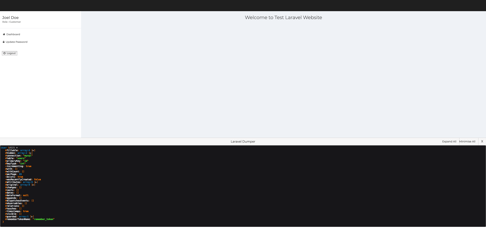
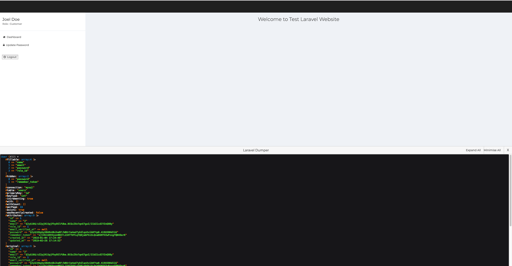

# A laravel package for inspecting dumps without interfering actual web page

Laravel has very cool `dump()` and `dd()` functions. However, sometimes it is not always pleasant to have those dumps on the main web view. This package enabled a very lightweight inspector just like devtools of the browser where all the dumps are stored.

## Usage : 

There is nothing fancy at all, you can directly call `idump()` function which you can remember as a dump inside an inspector window.

~~~php
<?php
$user = \App\User::first();
idump($user);
~~~

This will make your page appear as it is and will add a button on top right to open the inspector like below : 

    

Once you click on `Open Laravel Dumper` button, it will open very clean and simple inspector window like below : 

    

You can have multiple dumps anywhere in your project. Those will be stacked inside the inspector one after another.

You can make use of `Minimise All` action to collapse all dumps like below :

    

You can make use of `Expand All` action to expand all dumps like below :

    

## Wait.. There is more :

If there is only single variable passed to the idump, it returns the same which helps you to actually chain commands and use dump between like below : 

~~~php
<?php 

// This will dump the query builder in the dump inspector and continue the first operation
$user = idump(\App\User::where('name', 'like', '%john'))->first();
~~~

It is not recommended to use this on production environment. This is just to help you during the development lifecycle to make debugging more user friendly.
## License : 

This psckage is open-sourced software licensed under the MIT license